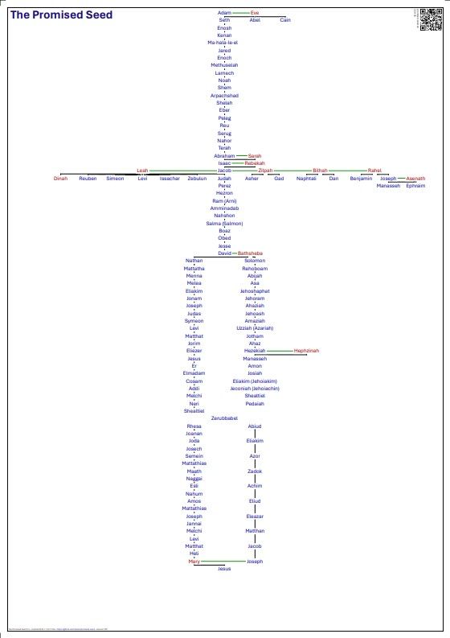

# The Promised Seed

Visualizing the lineage of Jesus, starting with Adam and connecting families and prophecies.

## Motivation

For people of Israel 2000 years ago it was of big importance to trace their family back in a genealogy. This was important to have a part in inherited land, or enjoy certain privileges. For example, after the exile in Babylon the families of _Habaiah_, _Hakkoz_, and _Barzillai_ who could not find their genealogical records. (Ezra 2:61-63, Nehemiah 7:63-65) Because they could not prove their lineage, they were excluded from the priesthood and forbidden to eat the sacred food until a priest could determine their status using the Urim and Thummim.

 

Of even greater importance was the lineage of the promised Messiah. He needed to be a son of Abraham, Judah and David. Therefore both Matthew and Luke include a geneaology of Jesus Christ. But if you look at them, you will find some differences. The more details one unveils, the more interesting and connected to world history this lineage becomes. Hence this project to condense and visualize some findings of this study. But first we have to think about size:

## Size consideration

In many digital documents you can zoom in 600%, with Affinity even more. But my goal was a possible printout, and this generates tangable constrains. I tested font sizes and consider 10 pt still to be good readable. The standard line distance is then 12 pt. So how many lines or rows are necessary?

### Account of Luke in 12 pt

The account of Luke lists 75 individuals. If we put each father in one line, we need 75 lines with the height of 12 points.

| from - to          | Luke | Matthew | maternal | legal | TPS1 | TPS2 |
|--------------------|:----:|:-------:|:--------:|:-----:|:----:|:----:|
| Adam - Noah        |  10  |         |    10    |   10  |  10  |  10  |
| Noah - Abraham     |  10  |         |    10    |   10  |  10  |  10  |
| Abraham - David    |  13  |    13   |    13    |   13  |  13  |  38  |
| David - Exile      |  20  |    14   |    19    |   17  |  21  |  34  |
| Exile - Zerubbabel |   2  |    2    |     3    |   3   |      |      |
| Zerubbabel - Jesus |  20  |    11   |    20    |   11  |  11  |  20  |
| sum                |  75  |    40   |    75    |   64  |  65  |  112 |

Matthew only begins with Abraham and describes the paternal or legal side of Jesus lineage. It includes many kings of Judah and has in total 40 persons. The account of Luke starts with Adan and has therefore 20 more names. From Zerubbabel the lineage is significantly longer (20 instead of 11 individuals) and concludes after 75 generations. Another project includes many more extra lines for other children and relatives. This requires an estimated 112 lines for all the information.

One point is 0.3528 millimeter large. 12 points equals 4.23 millimeter and 75 lines require 317.52 millimeter. A4 portrait has a height of 297 mm, A3 has 420 mm.

### Extra space for parent - children lines

I want some extra lines connecting parents to their childen, and 12 pt line height is too cramped. I decided to increase the line height to 14 pt. The results can be found in this table:

| number of   lines |  10 pt |  12 pt |  14 pt |  16 pt |
|:-----------------:|:------:|:------:|:------:|:------:|
|         1         | 3.53   | 4.23   | 4.94   | 5.64   |
|         66        | 232.85 | 279.42 | 325.99 | 372.56 |
|         75        | 264.60 | 317.52 | 370.44 | 423.36 |
|         85        | 299.88 | 359.86 | 419.83 | 479.81 |
|        112        | 395.14 | 474.16 | 553.19 | 632.22 |
|        1 pt       | 0.3528 | 0.3528 | 0.3528 | 0.3528 |

## History of this "The Promised Seed" repository

The motivation came from my old [timeline project](https://github.com/kreier/timeline) here on GitHub, that actually started with some curated HTML files in 2006. Over time it grew to a detailed chart of human history for the last 6000 years. From paper versions, html, OpenOffice spreadsheets, OpenOffice vector drawings to finally a Python program generated PDF of 1208x210 mm (or four A4 papers in landscape).

About the same time others started a related project, but focused on the lineage of Jesus and historic events related to "the promised seed". Their project has the size of 864x1118 mm (34x44 inch) and was created 2002-2005. Its final version looks like this:

I had heard about this project since 2023, and in 2025 I got a digital copy. But it is not intended to be shared online. Therefore there is only a rather fuzzy image embedded in this repository. 

So I thought about creating a similar document. The authorship was one consideration. The size was another consideration. The size of 864x1118 is very close to the size of A0 (841 x 1189 mm) and usually the largest size for a print shop. Still some parts are not easy to read. Could I create a smaller version that still would be readable? I certainly had to leave out some information of the original document. 

And I would have to check out the information for myself. Both as a study project, and to import the references in the dictionary files to help later in translations. A broad assumption: If I organize the data better, and leave out both timeline aspects (contemporary part and kings/prophets northern and southern kingdom) I might reduce the needed area to A1. Now reducing the information in the right column and leave out most of first and second generation children of the 12 tribes, getting another 50% and down to A2. Now split some information into two pages (like the two legends, some other large family side tree) and I'm at two A3 papers. Let's check:

## Is it possible to have the family history of Jesus on one A3 portrait page?

The vertical size of portrait A3 is 420 millimeters (297 mm wide). Since my timeline project is 210 millimeters high and can have 46 horizontal text lines in text size 10pt (12 pt line height, see [here for the calculation](https://github.com/kreier/timeline?tab=readme-ov-file#decision-on-the-dimensions-for-this-project)) this A3 paper can have up to 92 lines. But how many do we need?

The project above has 10 lines Adam-Moses, then 10 lines to Abraham, and 11 (4) lines to Judah.  A large block follows with 27 (9) lines to Jesse, the father of David. Then 9 (1) lines to Solomon, 25 (20) to Zerrubbabel and finally 20 (11) lines to Jesus. So a total of 10+10+11+27+9+25+20=112 lines that would not fit, but also 10+10+ 4+ 9+1+20+11=65 that would fit. It's promising!
