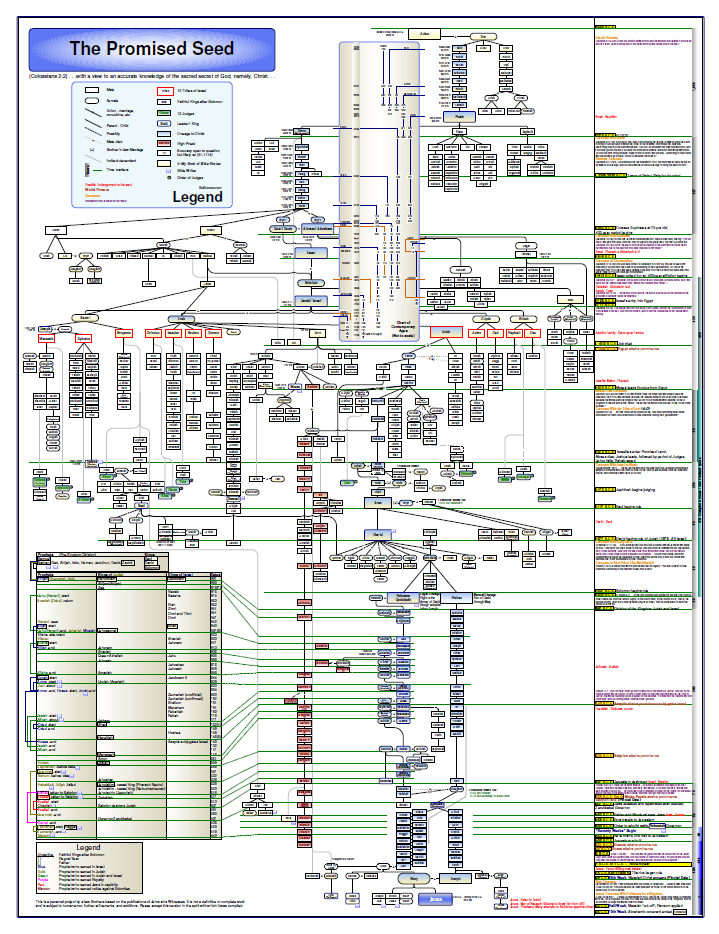

# History of this "The Promised Seed" repository

The motivation came from my old [timeline project](https://github.com/kreier/timeline) here on GitHub, that actually started with some curated HTML files in 2006. Over time it grew to a detailed chart of human history for the last 6000 years. From paper versions, html, OpenOffice spreadsheets, OpenOffice vector drawings to finally a Python program generated PDF of 1208x210 mm (or four A4 papers in landscape).

About the same time others started a related project, but focused on the lineage of Jesus and historic events related to "the promised seed". Their project has the size of 864x1118 mm (34x44 inch) and was created 2002-2005. Its final version looks like this:

I had heard about this project since 2023, and in 2025 I got a digital copy. But it is not intended to be shared online. Therefore there is only a rather fuzzy image embedded in this repository. 

So I thought about creating a similar document. The authorship was one consideration. The size was another consideration. The size of 864x1118 is very close to the size of A0 (841 x 1189 mm) and usually the largest size for a print shop. Still some parts are not easy to read. Could I create a smaller version that still would be readable? I certainly had to leave out some information of the original document. 

And I would have to check out the information for myself. Both as a study project, and to import the references in the dictionary files to help later in translations. A broad assumption: If I organize the data better, and leave out both timeline aspects (contemporary part and kings/prophets northern and southern kingdom) I might reduce the needed area to A1. Now reducing the information in the right column and leave out most of first and second generation children of the 12 tribes, getting another 50% and down to A2. Now split some information into two pages (like the two legends, some other large family side tree) and I'm at two A3 papers. Let's check:

## Is it possible to have the family history of Jesus on one A3 portrait page?

The vertical size of portrait A3 is 420 millimeters (297 mm wide). Since my timeline project is 210 millimeters high and can have 46 horizontal text lines in text size 10pt (12 pt line height, see [here for the calculation](https://github.com/kreier/timeline?tab=readme-ov-file#decision-on-the-dimensions-for-this-project)) this A3 paper can have up to 92 lines. But how many do we need?

The project above has 10 lines Adam-Moses, then 10 lines to Abraham, and 11 (4) lines to Judah.  A large block follows with 27 (9) lines to Jesse, the father of David. Then 9 (1) lines to Solomon, 25 (20) to Zerrubbabel and finally 20 (11) lines to Jesus. So a total of 10+10+11+27+9+25+20=112 lines that would not fit, but also 10+10+ 4+ 9+1+20+11=65 that would fit. It's promising!
